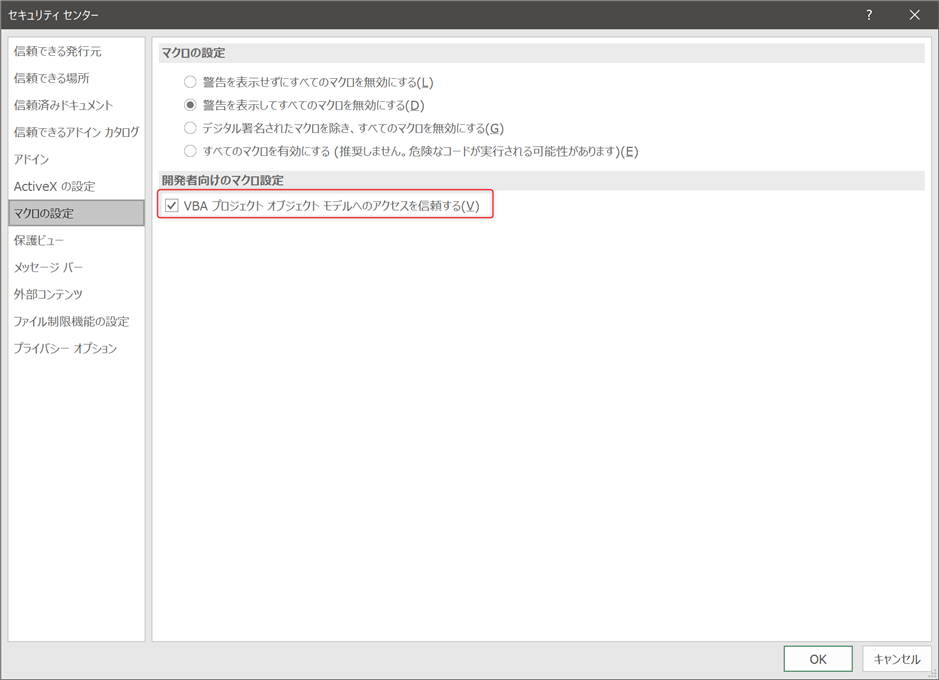

# ExcelTool

Excelブックからマクロをエクスポートしたりインポートしたりリムーブしたり

## 使い方

### 準備

Excelの設定変更  
ファイル→オプション→セキュリティセンター→セキュリティセンターの設定→(左側ナビ)マクロの設定→「VBAプロジェクトオブジェクトモデルへのアクセスを信頼する」にチェック


### xlsxにマクロをインポート

src以下にベースとなるxlsxファイルとvbファイル(bas,frm,cls)を配置

```
src
    clsHoge.bas
    clsPiyo.bas
    test.xlsx
```

コマンドを実行

```ps1
.\exec.ps1 -command combine -inputDir src -outputDir out
```

outputDirに指定したディレクトリにtest.xlsmが出力される

```
out
    test.xlsm
src
    clsHoge.bas
    clsPiyo.bas
    test.xlsx
```

### xlsmからマクロをエクスポート

src以下にベースとなるxlsmファイルを配置

```
src
    test.xlsm
```

コマンドを実行

```ps1
.\exec.ps1 -command decombine -inputDir src -outputDir out
```

outputDirに指定したディレクトリにtest.xlsxとvbファイル(bas,frm,cls)が出力される

```
out
    clsHoge.bas
    clsPiyo.bas
    test.xlsx
src
    test.xlsm
```

### xlsmからマクロをリムーブ

src以下にベースとなるxlsmファイルを配置

```
src
    test.xlsm  
```

コマンドを実行

```ps1
.\exec.ps1 -command clear -inputDir src -outputDir out
```

outputDirに指定したディレクトリにtest.xlsxが出力される

```
out
    test.xlsx
src
    test.xlsm

```
## TODO

- SaveAsに52とか61とかべた書きしてるのを定数にする
- コンポーネントのタイプに1,2,3とかべた書きしてるのを定数化する
- Excel開いたり閉じたりしてる部分を共通化したい
